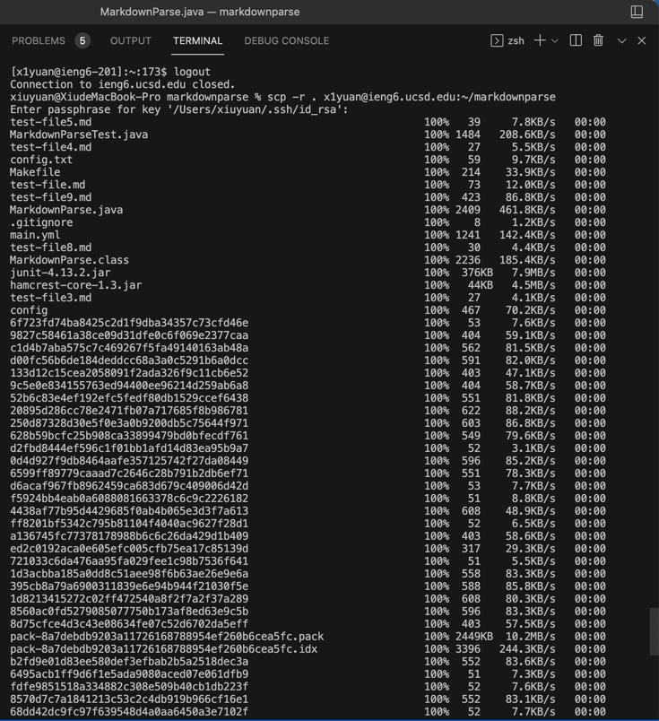
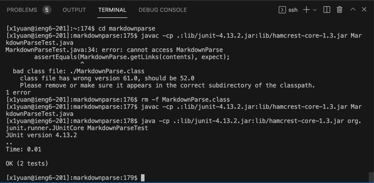
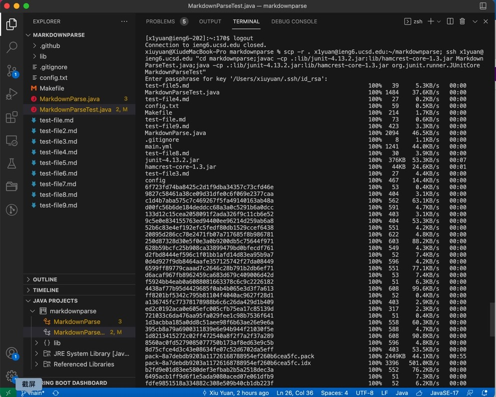
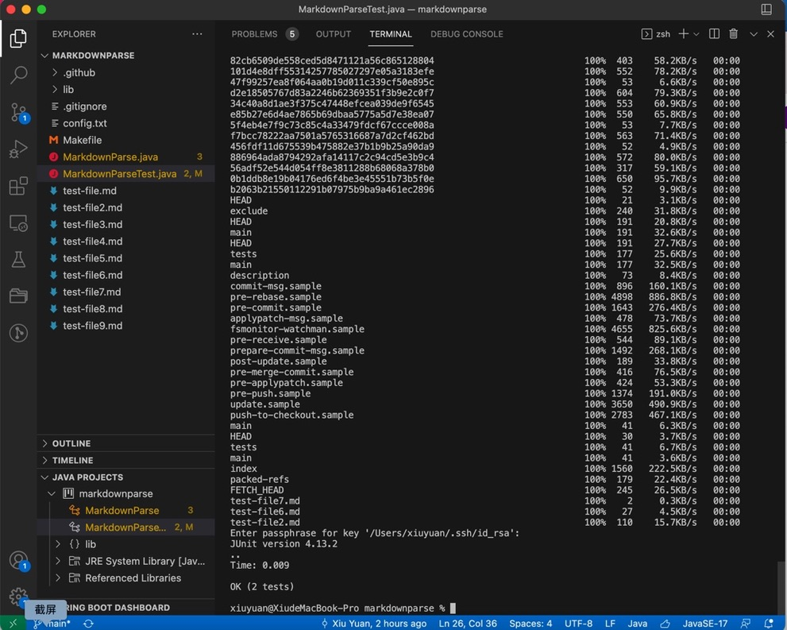

# Lab Report 3 : Copy the whole directory with scp -r

 

# Step 1: Copy the whole directory to server

>I use the following code to upload my markdownparse directory to server:

      scp -r . cs15lwi22zz@ieng6.ucsd.edu:~/markdownparse

>This command copies my whole directory to server side as shown in the following picture:

# Step 2: Log into ieng6 account and run the tests

>Then I log into my server account, go into the markdownparse and use the command line to run the junit test. All tests run and pass.

 

# Step 3: Combine scp, ;, and ssh to do all these actions in one line

> The following is the code I use:

    scp -r . x1yuan@ieng6.ucsd.edu:~/markdownparse; ssh x1yuan@ieng6.ucsd.edu "cd markdownparse; javac -cp .:lib/junit-4.13.2.jar:lib/hamcrest-core-1.3.jar MarkdownParseTest.java; java -cp .:lib/junit-4.13.2.jar:lib/hamcrest-core-1.3.jar: org.junit.runner.JUnitCore MarkdownParseTest"

>The following picture shows the result. The directory is correctly uploaded, and all tests run and pass.

